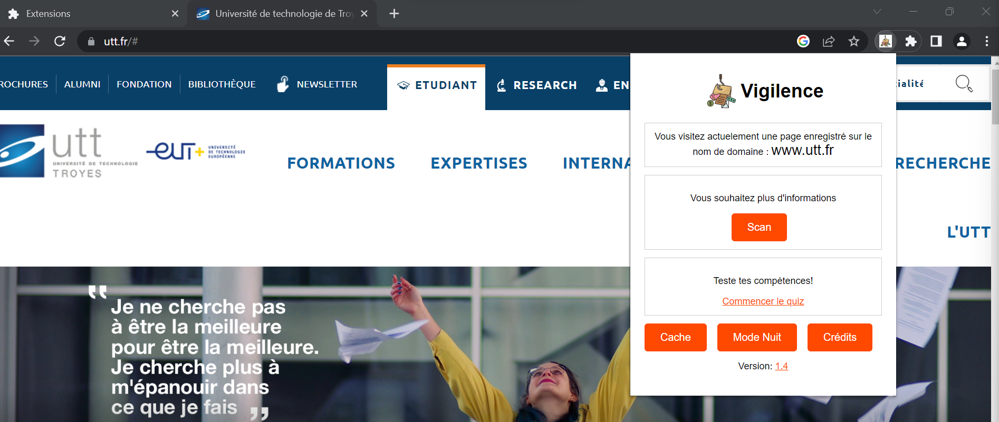

# Vigilence

> Une extension pour navigateur dédiée à la lutte contre les attaques de phishing en ligne.

## Table des matières

- [Aperçu](#aperçu)
- [Installation](#installation)
- [Utilisation](#utilisation)
- [Fonctionnalités](#fonctionnalités)
- [Contribution](#contribution)
- [Licence](#licence)

## Aperçu

**Vigilence** est une extension de navigateur conçue pour protéger les utilisateurs contre les attaques de phishing en ligne. Elle permet de surveiller les URLs que vous visitez et d'examiner des liens à l'aide du cache de google. Cette extension vous aide à garder une bonne hygiène cyber grâce ses fonctionnalitées et son quiz intégré.

## Installation

Vous pouvez installer l'extension **Vigilence** en suivant ces étapes simples :

#### Mode d'Emploi : Installation d'une Extension Chrome Empaquetée (.crx) depuis GitHub

1. **Téléchargement de l'Extension Empaquetée (.crx)**

   - Accédez à la page GitHub où le fichier .crx de l'extension est hébergé.
   - Cliquez sur le lien du fichier .crx pour le télécharger sur votre ordinateur.

2. **Ouverture des Extensions de Chrome**

   - Ouvrez Google Chrome sur votre ordinateur.
   - Tapez `chrome://extensions/` dans la barre d'adresse et appuyez sur Entrée.

4. **Activation du Mode de Développeur**

   - Dans la page des extensions, activez le bouton "Mode développeur" en haut à droite.

5. **Installation de l'Extension Empaquetée (.crx)**

   - Localisez le fichier .crx que vous avez téléchargé.
   - Faites glisser le fichier .crx sur la page des extensions.

6. **Confirmation de l'Installation**

   - Une fenêtre de confirmation apparaîtra.
   - Cliquez sur "Ajouter l'extension" pour confirmer.

7. **Extension Installée**

   - L'icône de l'extension apparaîtra dans la barre d'outils de Chrome.

8. **Paramètres de l'Extension**

   - Cliquez sur l'icône de l'extension pour accéder à ses paramètres et fonctionnalités.
  
   

### Mode d'Emploi : Installation d'une Extension Chrome Non Empaquetée depuis GitHub

1. **Téléchargement du Code Source de l'Extension**

   - Accédez à la page GitHub du dépôt de l'extension.
   - Cliquez sur le bouton "Code" en vert et sélectionnez "Download ZIP".
   - Le code source de l'extension sera téléchargé sous forme de fichier ZIP sur votre ordinateur.

2. **Extraction du Code Source**

   - Trouvez l'emplacement où le fichier ZIP a été téléchargé.
   - Cliquez avec le bouton droit sur le fichier ZIP et choisissez "Extraire tout".
   - Sélectionnez un dossier de destination pour extraire le contenu.

3. **Ouverture des Extensions de Chrome**

   - Ouvrez Google Chrome sur votre ordinateur.
   - Tapez `chrome://extensions/` dans la barre d'adresse et appuyez sur Entrée.

4. **Activation du Mode de Développeur**

   - Dans la page des extensions, activez le bouton "Mode développeur" en haut à droite.

5. **Chargement de l'Extension Non Empaquetée**

   - Cliquez sur le bouton "Charger l'extension non empaquetée".
   - Sélectionnez le dossier où vous avez extrait le code source de l'extension.

6. **Confirmation de l'Installation**

   - L'extension apparaîtra dans la liste des extensions.
   - L'icône de l'extension apparaîtra également dans la barre d'outils de Chrome.

7. **Paramètres de l'Extension**

   - Cliquez sur l'icône de l'extension pour accéder à ses paramètres et fonctionnalités.

## Utilisation

Une fois installée, l'extension travaille en arrière-plan pour protéger vos activités de navigation. Lorsque vous accédez à un site web, l'extension analyse l'URL et vous permet de vérifier en un clic si elle correspond à une liste de sites de malvéillents connus. 

## Fonctionnalités

- Analyse des URLs via URLVOID.
- Quiz de sensibilisation.
- Possibilité de visualiser un site sans le consulter.

## Contribution

Si vous souhaitez contribuer à l'amélioration de **Vigilence**, n'hésitez pas à soumettre des problèmes (issues) et des demandes de fusion (pull requests) sur notre [dépôt GitHub]([lien_vers_le_dépôt](https://github.com/B-775/Vigilence/issues)). Votre contribution nous aidera à rendre Internet plus sûr pour tous.

## Licence

**Vigilence** est distribué sous la licence [Apache](LICENSE), ce qui signifie que vous êtes libre de l'utiliser, de le modifier et de le distribuer conformément aux termes de cette licence.

---
Developpeur: @B7
